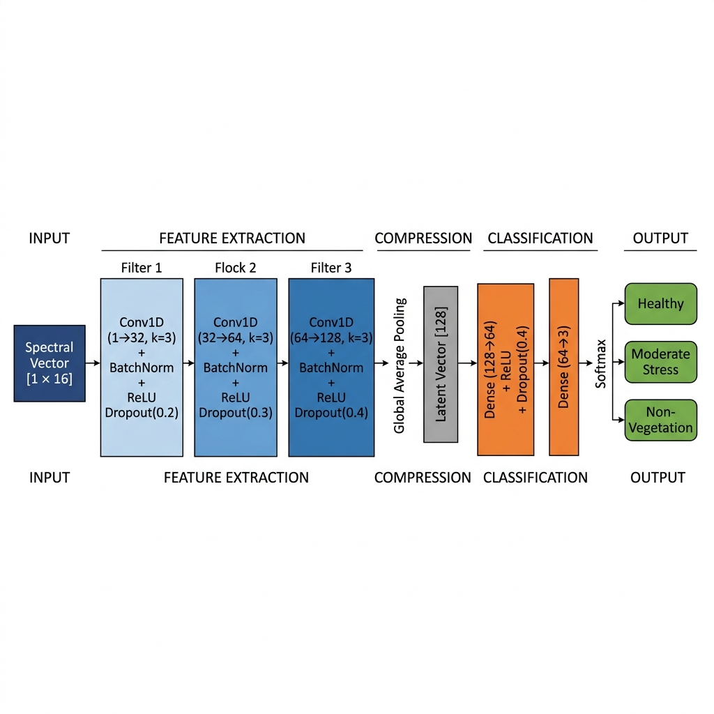
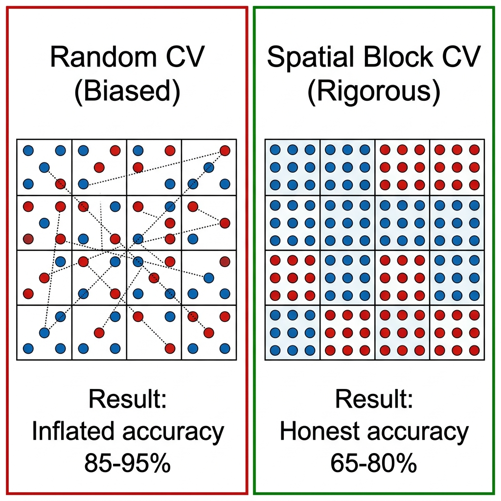
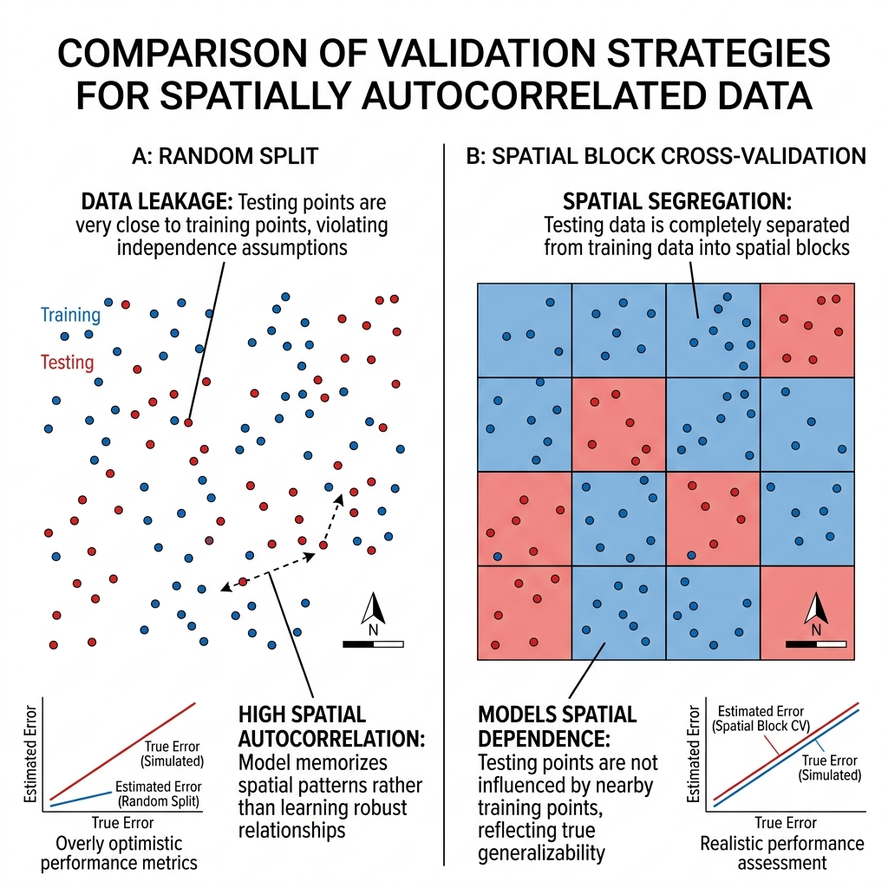
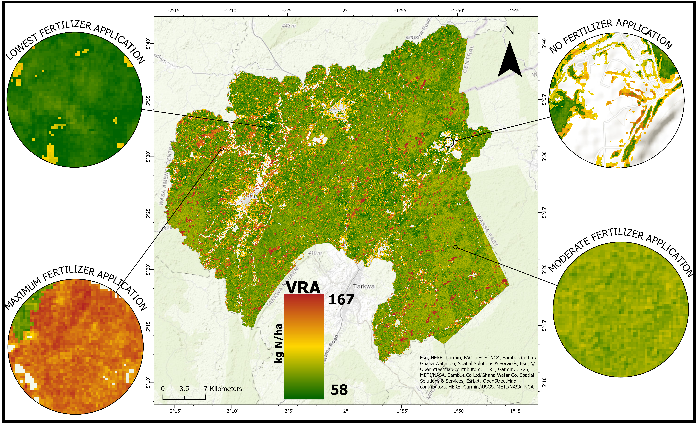

# 🌱 VegHealthCNN: 1D-CNN for Spectral-Temporal Crop Health Mapping & Precision Agriculture

[](https://pytorch.org/)
[](https://earthengine.google.com/)
[](https://scikit-learn.org/)
[](https://ucc.edu.gh/)

> **Official Paper Title:**  
> *GeoAI-Driven Precision Health Classification and Variable-Rate Nitrogen Prescribing in Ghana Using a 1D-CNN and Spatial Block Cross-Validation*  
> **Author:** Emmanuel Yerbo (Department of Geography and Regional Planning, University of Cape Coast, Ghana)  
> **Presented at:** GeoAI for Sustainable Development Conference (GeoAI4SD 2026)

---

## 📌 Executive Summary
VegHealthCNN is a lightweight **1D-Convolutional Neural Network (57,091 parameters)** designed for pixel-level crop health classification from Sentinel-2 Level-2A 14-band spectral-index stacks. 

### Key Innovations & Milestones:
1. **Spatial Block Cross-Validation ($0.01^\circ$ geographic blocks, ~1.1 km):** Prevents spatial autocorrelation data leakage, achieving **98.7% test accuracy** on 301 spatially independent ground-truth samples.
2. **Dual-Axis Transferability:** Demonstrates zero-retraining generalization across space (Akaakuma training domain $	o$ Prestea Huni-Valley Municipality) and time (2024 $	o$ 2025).
3. **Environmental & Economic Impact:** Detected **370.31 km² of galamsey-induced vegetation loss** and formulated an NDRE-modulated Variable-Rate Application (VRA) nitrogen prescription saving **19.5% fertilizer (~4.02 million kg N)** across 172,334 hectares.

---

## 🏗️ Deep Architecture



```
Input (14 spectral features)
  │
  ├── Conv1D (1 -> 32, k=3, p=1) -> BatchNorm -> ReLU -> Dropout(0.2)
  ├── Conv1D (32 -> 64, k=3, p=1) -> BatchNorm -> ReLU -> Dropout(0.3)
  ├── Conv1D (64 -> 128, k=3, p=1) -> BatchNorm -> ReLU -> Dropout(0.4)
  │
  ├── AdaptiveAvgPool1d(1) -> Flatten
  │
  ├── Linear(128 -> 64) -> ReLU -> Dropout(0.3)
  └── Linear(64 -> 3) -> Softmax [Healthy, Moderate Stress, No-Vegetation]
```

---

## 🧪 Spatial Validation: Random Split vs Spatial Block CV

Standard random train/test splits severely inflate model metrics due to spatial proximity autocorrelation. We partitioned the geographic domain into **$0.01^\circ$ geographic blocks** (~1.1 km) using `GroupKFold`.





### Spatially Independent Test Metrics (301 Samples):
| Class | Precision | Recall | F1-Score |
|---|---|---|---|
| **Healthy Vegetation** | 0.99 | 0.98 | 0.99 |
| **Moderate Stress** | 0.97 | 0.99 | 0.98 |
| **No-Vegetation (Galamsey/Bare)** | 1.00 | 1.00 | 1.00 |
| **Overall Accuracy** | | | **98.7%** |

---

## 🗺️ Dual-Axis Transferability (Space & Time)

### Spatial Transfer (Akaakuma $	o$ Prestea Huni-Valley):


### Temporal Dynamics (2024 $	o$ 2025 Galamsey Impact):


| Metric | 2024 Baseline | 2025 Monitoring | Net Dynamics |
|---|---|---|---|
| **Healthy Vegetation** | 1,407.82 km² (77.85%) | 1,037.51 km² (57.37%) | **−370.31 km²** (Contraction) |
| **Moderate Stress** | 622.28 km² (34.41%) | 623.49 km² (34.48%) | **+1.21 km²** |
| **No-Vegetation (Galamsey/Bare)** | 86.25 km² (4.77%) | 147.35 km² (8.15%) | **+61.10 km²** (Degradation) |

---

## 🌾 Variable-Rate Nitrogen Application (VRA) Prescription



- **Blanket Uniform Rate (120 kg N/ha):** 20,680,080 kg N
- **VRA Dynamic Prescription:** 16,656,250 kg N
- **Total Fertilizer Saved:** **4,023,830 kg N (19.5% reduction)**

---

## 📁 Project Directory Structure
```text
01_VegHealthCNN/
├── README.md                      <-- Technical project documentation
├── requirements.txt               <-- PyTorch, Rasterio, GeoPandas
├── notebooks/
│   └── VegHealthCNN_Pipeline.ipynb <-- Complete training and evaluation notebook
├── src/
│   ├── model.py                   <-- 57,091-parameter 1D-CNN implementation
│   ├── spatial_block_cv.py        <-- GroupKFold spatial blocking
│   └── vra_prescription.py       <-- VRA nitrogen prescription logic
├── paper/
│   └── GEOAI4SD_2026_EMMANUEL_YERBO.docx <-- Complete accepted conference paper
├── presentation/
│   └── GeoAI4SD_2026_Presentation.pptx   <-- Oral presentation slide deck
└── results/                       <-- High-resolution visual figures and maps
```

---

## ⚡ Quickstart & Reproducibility
```bash
cd 01_VegHealthCNN
pip install -r requirements.txt
python src/model.py
```

---

## 📚 Citation
```bibtex
@inproceedings{yerbo2026geoai,
  title     = {GeoAI-Driven Precision Health Classification and Variable-Rate 
               Nitrogen Prescribing in Ghana Using a 1D-CNN and Spatial Block 
               Cross-Validation},
  author    = {Yerbo, Emmanuel},
  booktitle = {Proceedings of the GeoAI for Sustainable Development Conference (GeoAI4SD)},
  year      = {2026},
  address   = {Cape Coast, Ghana},
  institution = {Department of Geography and Regional Planning, University of Cape Coast}
}
```
