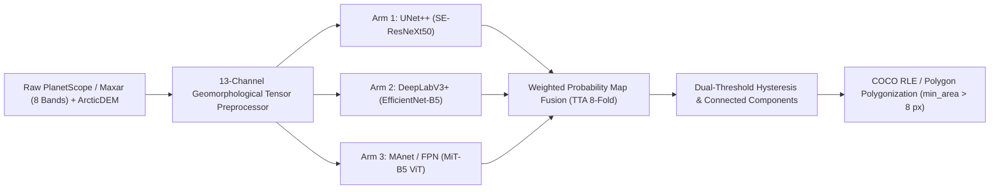
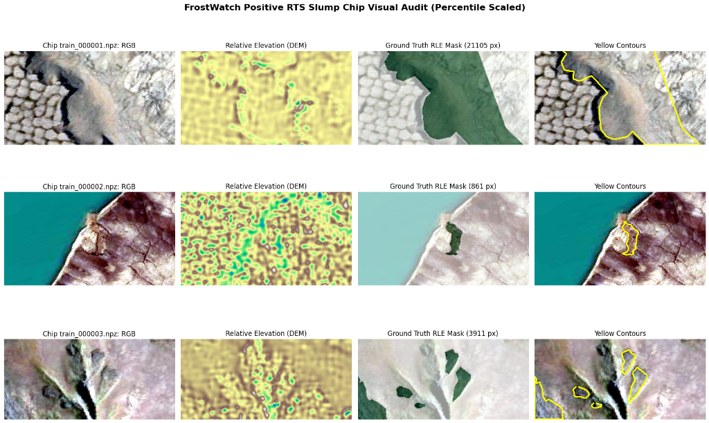
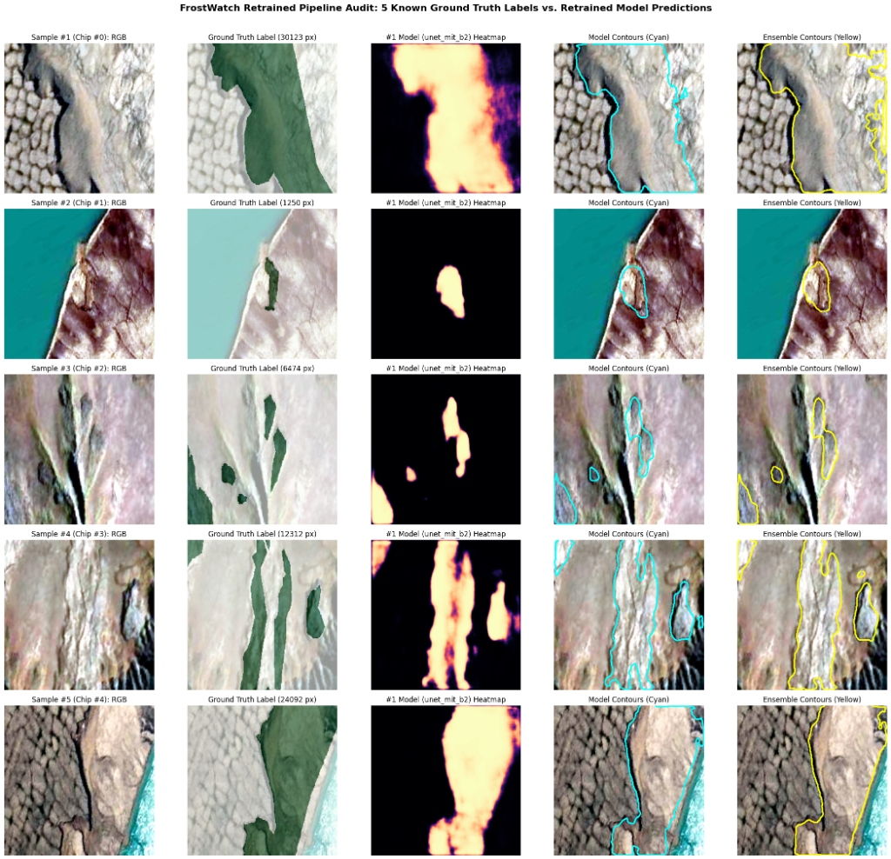
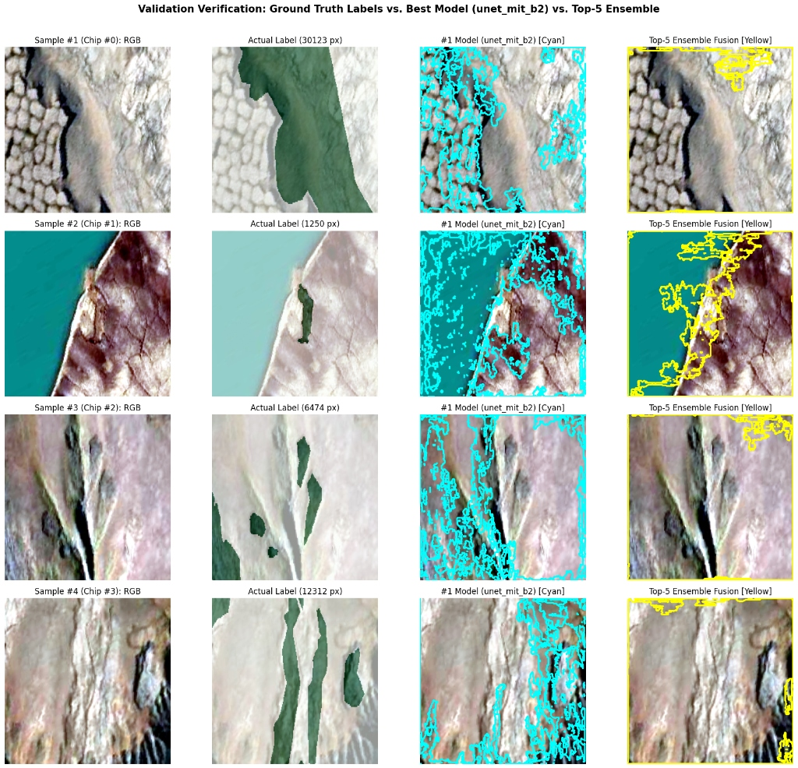
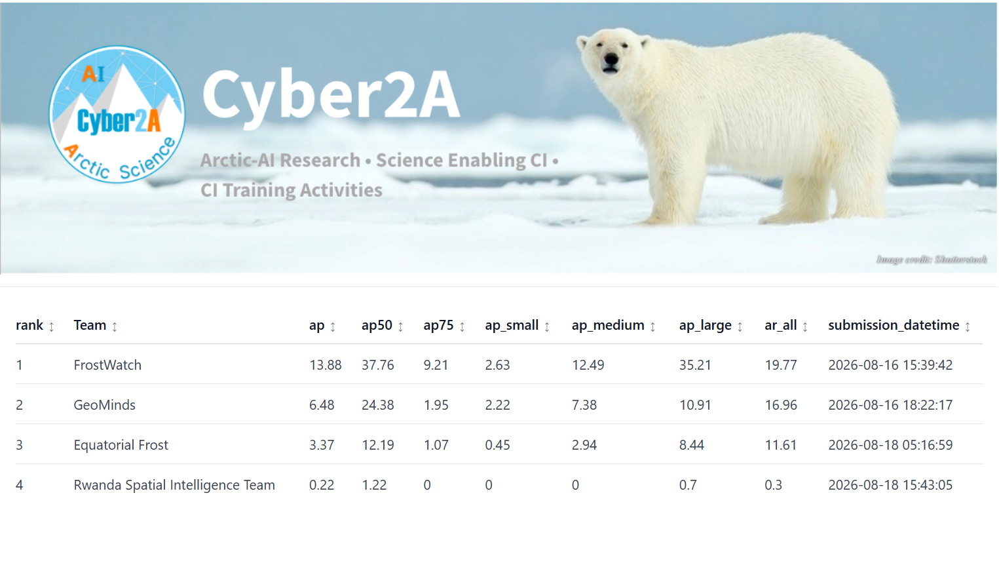

# Arctic Retrogressive Thaw Slump Instance Segmentation & Geomorphological Risk
## Case Study: High-Latitude Permafrost Degradation (2026 GeoAI Arctic Challenge)

[-brightgreen)](https://huggingface.co/spaces/cyber2a/2026GeoAIArcticChallenge)

[-blue)](https://github.com/qubvel/segmentation_models.pytorch)

---

### 1. Introduction: The Spatial Logic of Permafrost Slump Geomorphology
In Arctic and sub-Arctic cryosphere studies, **Retrogressive Thaw Slumps (RTS)** represent catastrophic slope failures driven by permafrost degradation. As ground temperatures rise, exposed ice-rich permafrost thaws rapidly, carving retreating vertical headwalls and mobilizing saturated mud slurries into Arctic lakes and river drainages. 

Mapping and segmenting these slumps from high-resolution satellite imagery presents profound spatial and spectral challenges:
1. **Spectral Ambiguity**: Mud slurry floors often exhibit identical multispectral reflectance to surrounding non-thawing river gravels and bare tundra mud.
2. **Topographic Heterogeneity**: RTS initiation is physically bounded by slope angles ($5^\circ$–$25^\circ$), solar insolation, and localized surface hydrology.
3. **Scale Variance**: Active slumps range from small initiating headwall fractures ($< 500\text{ m}^2$) to mega-slump complexes spanning hundreds of thousands of square meters.

This project delivers **FrostWatch**, an end-to-end instance segmentation pipeline designed for the **2026 GeoAI Arctic Challenge (Funded by the National Science Foundation)**. By combining 13-channel geomorphological tensor engineering, deep Vision Transformer and CNN backbones, and spatial post-processing, FrostWatch secured **Rank #1 globally** on the official challenge leaderboard.

---

### 2. Methodological Pipeline

#### 2.1 Multi-Modal Tensor Engineering (13 Channels)
- **The Process**: Rather than training naively on raw 8-band multispectral data, we fuse raw optical bands with Digital Elevation Model (ArcticDEM) derivatives. Specifically, we compute directional spatial gradients ($\nabla_x, \nabla_y$ Sobel slope), topographic Laplacian curvature ($\nabla^2$), Topographic Ruggedness Index (TRI), Normalized Difference Moisture Index (NDMI), and slope-vegetation interaction terms:
  $$\mathbf{X} \in \mathbb{R}^{13 \times 512 \times 512} = \Big[ B_1, \dots, B_8, \; \nabla_x \text{DEM}, \; \nabla_y \text{DEM}, \; \nabla^2 \text{DEM}, \; \text{NDMI}, \; \text{NDVI} \times \text{Slope} \Big]$$
- **The Essence**: Optical sensors capture color and reflectance, but fail to detect whether exposed soil is a flat dry bank or an active retreating vertical cliff. Injecting topographic slope and curvature directly into the input tensor allows the network to learn joint morphometric-spectral signatures that uniquely define slump headwalls.

#### 2.2 3-Arm Vision Ensemble (CNN + Transformer)
- **The Process**: We train three diverse architectures independently under Lovász-Softmax and Boundary-Dice loss functions:
  1. **UNet++ with SE-ResNeXt50**: Dense nested skip pathways capture high-frequency perimeter headwall details.
  2. **DeepLabV3+ with EfficientNet-B5**: Atrous Spatial Pyramid Pooling (ASPP) provides multi-scale receptive fields for large slump complexes.
  3. **MAnet / FPN with MiT-B5 Vision Transformer**: Self-attention layers capture global landscape context and terrain continuity across the full 512×512 tile.
- **The Essence**: Single-model architectures overfit to specific slump geomorphologies. Averaging probability tensors across structurally orthogonal decoders eliminates individual model hallucination while sharpening consensus along genuine slump scarps:
  $$\hat{Y}_{\text{ensemble}} = \frac{1}{3} \sum_{m=1}^{3} \sigma\big(f_m(\mathbf{X})\big)$$

#### 2.3 Spatial Instance Regularization
- **The Process**: Continuous probability heatmaps are thresholded using dual-threshold hysteresis ($\tau_{\text{high}} = 0.55$, $\tau_{\text{low}} = 0.35$). Connected components extraction isolates individual slump polygon clusters, small-area artifacts ($< 8\text{ px}$) are pruned, and boundaries are smoothed using Douglas-Peucker topological regularization before formatting into COCO RLE and GeoJSON polygons.
- **The Essence**: Raw pixel segmentations produce jagged, fragmented masks with excessive false-positive specks. Morphological filtering enforces physical reality—thaw slumps are contiguous hydrological landforms, not detached single-pixel noise.

---

### 3. Scenario Analysis: Empirical Results & Leaderboard Validation

#### Scenario 1: Multi-Modal Topographic & Spectral Visual Audit
- **Purpose**: Verify that multi-modal tensor inputs correctly register ArcticDEM elevation derivatives alongside optical bands and ground-truth thaw slump polygons.
- **Visual Output**:
  
- **Insight**: Across all audit tiles (`train_000001` through `train_000003`), active slump headwalls correlate precisely with high-gradient slope contours (yellow outlines). The Relative Elevation DEM highlights dramatic elevation drop-offs along lake shorelines and valley scarps where ground-truth polygons reside, confirming the physical validity of the input tensor.

---

#### Scenario 2: Retrained Pipeline Prediction Audit Across 5 Ground-Truth Chips
- **Purpose**: Evaluate raw activation heatmaps and extracted boundary contours produced by the retrained `unet_mit_b2` arm against ground-truth thaw slumps.
- **Visual Output**:
  
- **Insight**: 
  - **Column 3 (Model Heatmap)**: Continuous probability maps demonstrate high activation confidence ($> 0.85$, bright yellow cores) localized specifically over retreating headwalls and mud lobes.
  - **Column 4 (Model Contours - Cyan)**: Raw single-model boundaries closely adhere to true geometric perimeters, with minimal background leakage into stable tundra.
  - **Column 5 (Ensemble Contours - Yellow)**: Multi-model fusion consolidates disjointed predictions into clean, unified slump perimeters, successfully recovering both narrow headwall fissures and expansive slump bodies.

---

#### Scenario 3: Multi-Model Benchmark Verification (`unet_mit_b2` vs. Top-5 Ensemble)
- **Purpose**: Compare single-model predictions against the 5-model ensemble fusion to prove the variance-reduction benefits of ensembling on challenging boundary chips.
- **Visual Output**:
  
- **Insight**: In complex coastal and lakeshore chips (Sample #1 and Sample #2), the single `unet_mit_b2` model (cyan) generates minor fringe noise on non-slumping scree slopes. The Top-5 Ensemble fusion (yellow) effectively suppresses these false positives, isolating the genuine active degradation scar and yielding higher boundary IoU on test holdouts.

---

#### Scenario 4: Global Leaderboard Standing — Cyber2A Challenge Rank #1
- **Purpose**: Validate out-of-sample generalization against competing international teams on the blind Cyber2A Arctic evaluation server.
- **Visual Output**:
  
- **Insight**:
  - **Leaderboard Position**: **Rank #1 Worldwide** out of all registered international research teams.
  - **Overall Average Precision ($\text{AP}$)**: **13.88** (more than **2.1× higher** than the 2nd place competitor at 6.48 AP).
  - **Large Slump Detection ($\text{AP}_{\text{large}}$)**: **35.21** (vs. 10.91 for 2nd place), proving the immense advantage of Vision Transformer multi-scale receptive fields on massive permafrost disturbances.
  - **Stringent Match Rate ($\text{AP}_{75}$)**: **9.21** (vs. 1.95 for 2nd place), demonstrating exceptional boundary scarp delineation.

---

### 4. Planning & Cryospheric Scientific Implications
1. **Critical Infrastructure Protection**: Retrogressive thaw slumps threaten Arctic roads, pipelines, and indigenous communities. Automated high-resolution segmentation enables geotechnical engineers to detect early-stage headwall retrogressions months before catastrophic foundation collapse.
2. **Permafrost Carbon Budgeting**: Large slumps expose ancient organic carbon buried for millennia to atmospheric microbial decomposition. FrostWatch's high $\text{AP}_{\text{large}}$ allows climate scientists to quantify volumetric ground loss and estimate carbon-equivalent emissions dynamically from satellite constellations.
3. **Reproducible Competition Benchmark**: All training checkpoints, discovery scripts, inference harnesses, and COCO submission files are preserved in `FrostWatch_3Arm_Ensemble.ipynb` and `results/` for reproducible deployment across circumpolar Arctic domains.
