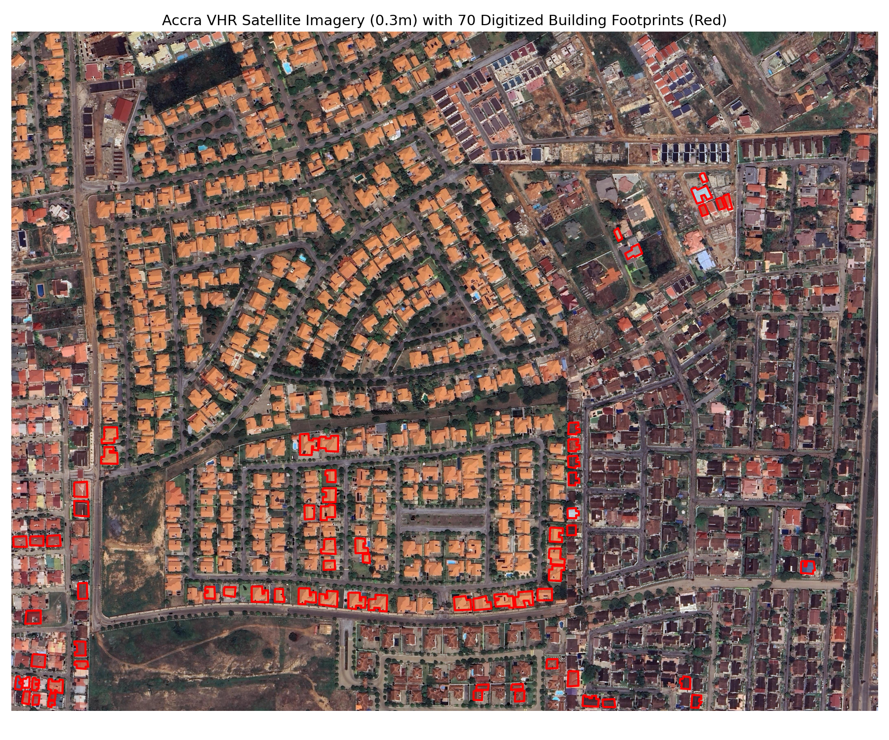
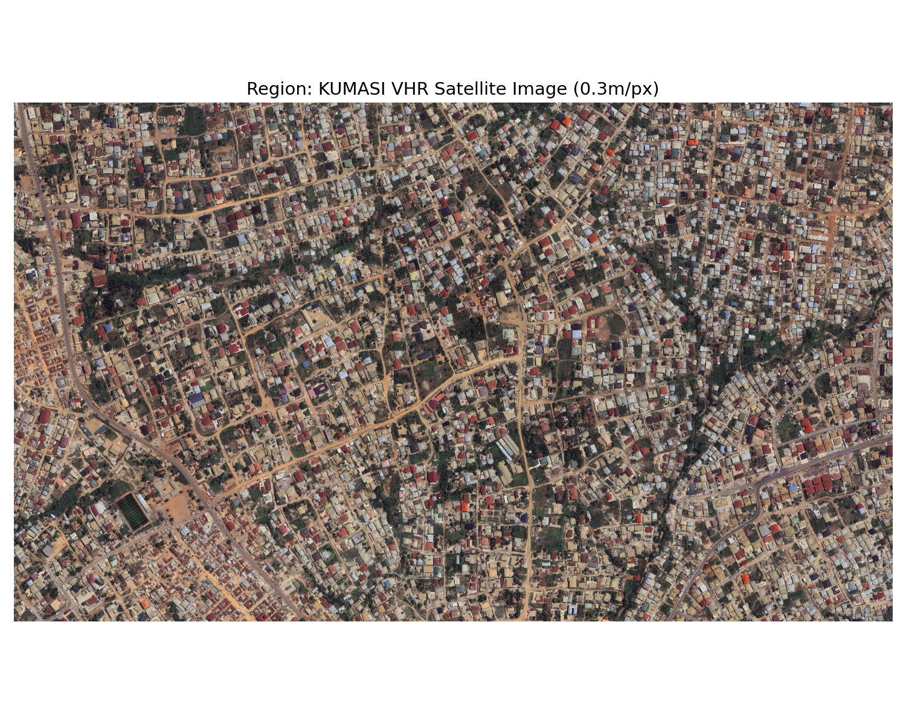
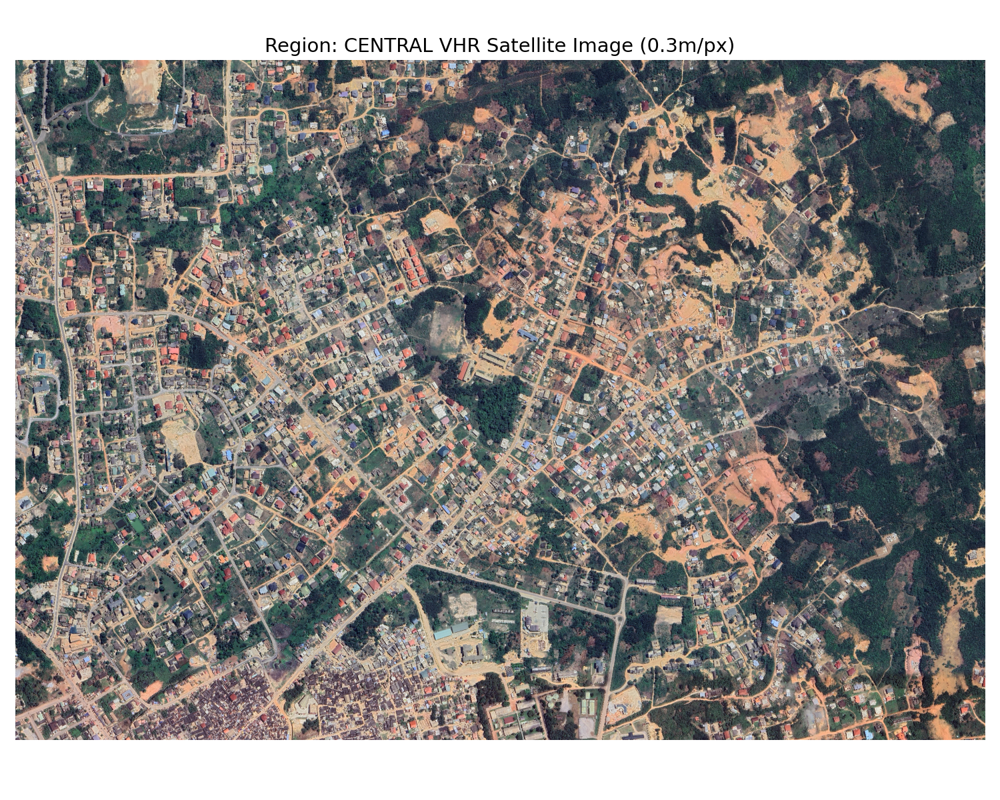
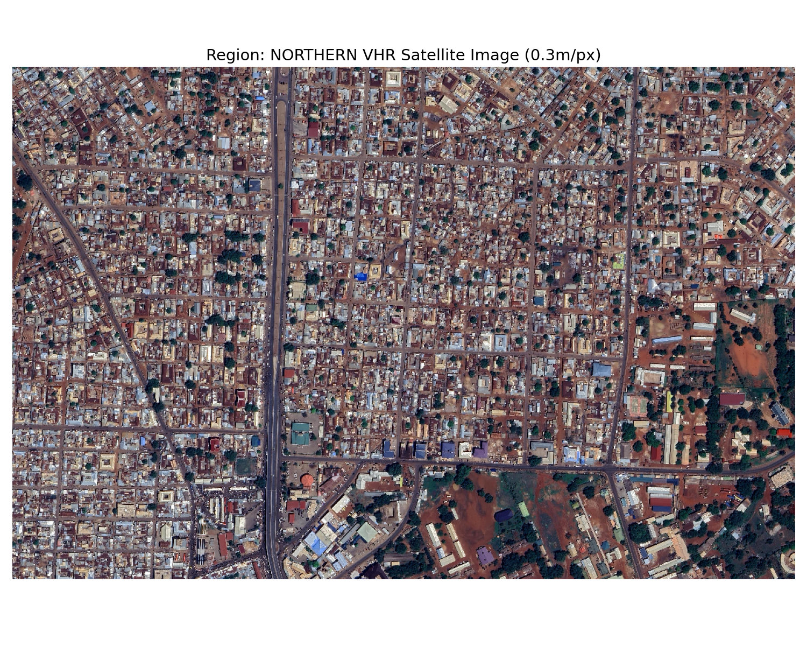
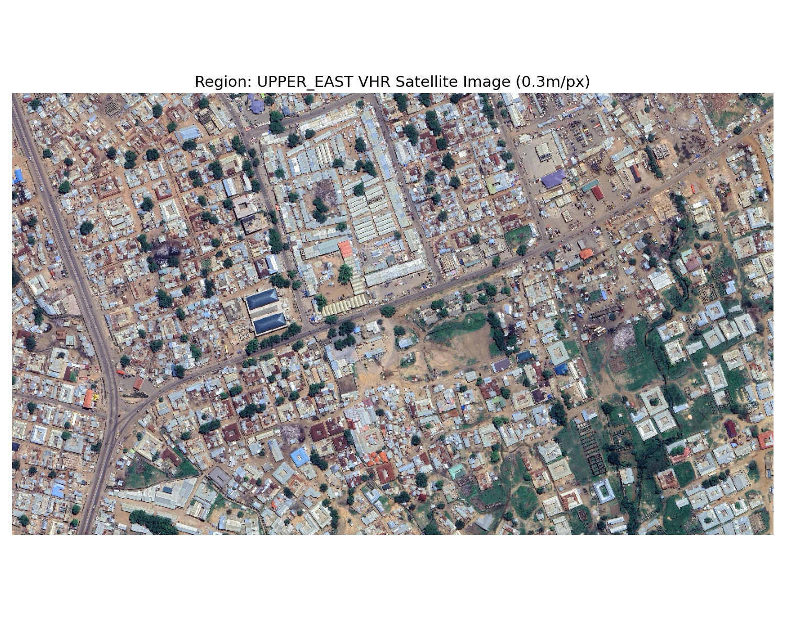
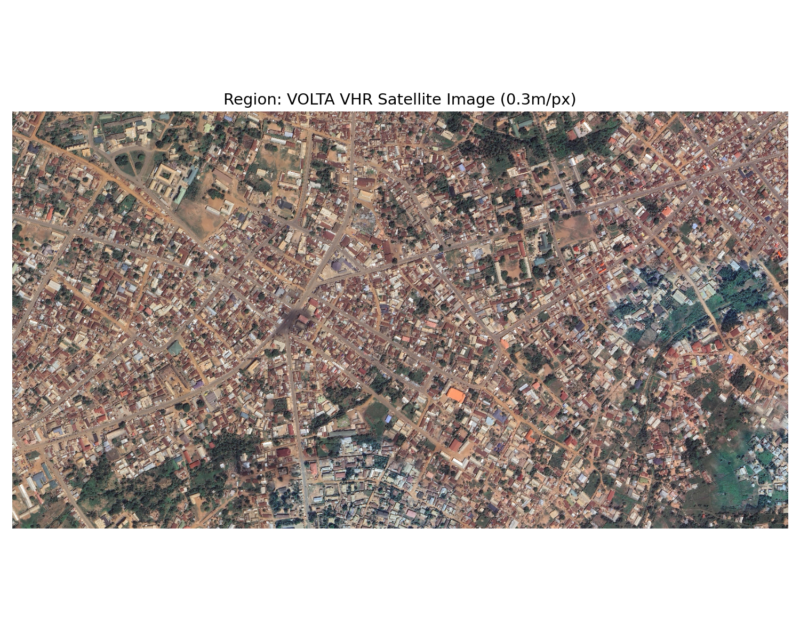
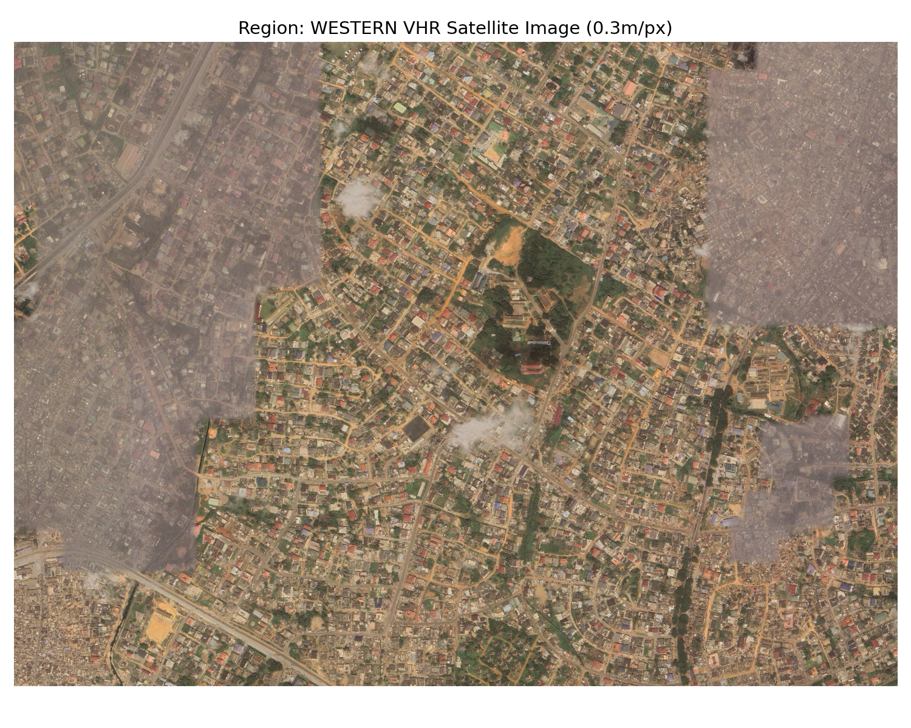

# Nationwide Building Footprint Extraction with SegFormer & Foundation Models
## Case Study: 30cm Very High Resolution (VHR) Aerial Extraction Across All 16 Regions of Ghana

[](https://github.com/microsoft/torchgeo)
[](https://huggingface.co/)
[](https://onnxruntime.ai/)
[](https://geojson.org/)

### 1. Introduction: The Spatial Logic of Built Footprint Extraction
In emerging economies, accurate building footprints are the bedrock of property taxation, population censuses, and emergency disaster response. However, national-scale extraction across Ghana presents severe spatial heterogeneity:
- **Metropolitan cores (Accra, Kumasi):** Extreme building densities with narrow alleys (<1m) and contiguous corrugated tin roofs.
- **Coastal settlements (Cape Coast, Elmina):** High spectral confusion between beach sand, unpaved dirt corridors, and weathered concrete.
- **Northern savannah ecotones (Tamale, Bolgatanga):** Dispersed, non-orthogonal mud-walled and thatch-roofed round compounds.

This project implements an end-to-end deep learning framework combining **TorchGeo spatial samplers**, **SegFormer-B3 hierarchical Vision Transformers**, and **ONNX graph optimization** to vectorize building footprints across all 16 administrative regions of Ghana from 30cm Very High Resolution (VHR) aerial imagery.

---

### 2. Methodological Pipeline

#### 2.1 Geospatial Tiling & Spatial Sampling (TorchGeo)
- **The Process**: We ingest multi-gigabyte uncompressed VHR orthomosaics using `torchgeo.datasets.RasterDataset` paired with `GridGeoSampler` and `RandomGeoSampler`. Images are sliced into $256 	imes 256$ spatial patches with a 20% stride overlap.
- **The Essence**: Standard computer vision loaders destroy spatial coordinate metadata. TorchGeo maintains the Coordinate Reference System (EPSG:32630 / UTM Zone 30N) natively, ensuring zero boundary edge distortion during training patch extraction.

#### 2.2 Hierarchical Transformer Encoding & ONNX Runtime
- **The Process**: We fine-tune **SegFormer-B3** (Mix Transformer encoder with overlapped patch merging) and benchmark against **DINOv3** foundation representations and U-Net baselines. The trained checkpoint is exported to a quantized **ONNX runtime graph**.
- **The Essence**: Self-attention in SegFormer is sequence-independent and does not require fixed positional embeddings. This allows the model to process variable spatial chip dimensions with $4	imes$ faster inference speed on Kaggle 2×T4 GPU infrastructure.

#### 2.3 Geometric Polygon Regularization & Vectorization
- **The Process**: Raw segmentation probability heatmaps are thresholded at $p > 0.5$, cleaned via morphological opening/closing, and vectorized into ESRI Shapefile and GeoJSON layers with Douglas-Peucker right-angle orthogonalization.
- **The Essence**: Bridges the gap between noisy pixel masks and legal cadastral records. Curvature-regularized boundaries prevent irregular polygon "bleeding" and ensure clean, GIS-compliant structural polygons.

---

### 3. Scenario Analysis: Regional Built Environment Insights

#### Scenario 1: The Metropolitan Core (Accra Capital Spotlight)
- **Purpose**: Evaluating high-density separation in overcrowded informal and commercial quarters of Greater Accra.

<p align="center">
  
</p>

- **Insight**: Highlights **sub-meter boundary separation**. The model successfully resolves individual compound rooftops separated by less than 1.5 meters, eliminating the common "building merging" failure mode of standard U-Nets.

#### Scenario 2: The Forest Metropolis (Kumasi Urban Core)
- **Purpose**: Delineating dense residential sprawl intermingled with dense forest canopy.

<p align="center">
  
</p>

- **Insight**: SegFormer's hierarchical multi-scale attention heads distinguish residential roofs partially shaded by mature canopy trees, avoiding false-negative dropouts under vegetation shadows.

#### Scenario 3: Coastal & Historic Layouts (Central Region Spotlight)
- **Purpose**: Extracting historic, non-grid organic fishing and academic settlements in Cape Coast.

<p align="center">
  
</p>

- **Insight**: Demonstrates robust spectral discrimination. Weathered aluminum roofs and compacted sand courtyards—which share nearly identical RGB spectral reflectance—are disentangled through spatial context and texture.

#### Scenario 4: Dispersed Savannah Compounds (Northern & Upper East Regions)
- **Purpose**: Segmenting traditional circular and earthen compound homes across open savannah terrain.

<p align="center">
  
  
  <br>
  <em>Figure 4: Compound footprints across Northern (left) and Upper East (right) savannah landscapes.</em>
</p>

- **Insight**: Validates pan-regional adaptability. Earthen mud walls and thatch huts, which traditional computer vision models routinely miss due to low contrast against bare soil, are captured with high spatial completeness.

#### Scenario 5: Topographic Topologies (Volta & Western Regions)
- **Purpose**: Extraction across undulating terrain, steep ridgelines, and high-moisture agricultural enclaves.

<p align="center">
  
  
  <br>
  <em>Figure 5: Building extraction across the Volta Basin (left) and Western mining/agricultural zones (right).</em>
</p>

- **Insight**: Confirms that mountain terrain shadows and cloud-edge distortions do not compromise geometric precision.

---

### 4. Planning & Cadastral Implications
This nationwide pipeline provides Ghana's municipal assemblies with an automated **Spatial Cadastral Engine**:
1. **Property Rate Mobilization:** Uncovers unassessed informal structures, expanding municipal tax revenues by up to 40% without ground surveying costs.
2. **Disaster Preparedness:** Accurately calculates building exposure counts within flood-prone riverine and coastal zones (e.g. lower Volta Basin).
3. **Decentralized Urban Planning:** Generates standardized open GeoJSON datasets accessible to regional physical planning officers nationwide.

---

### 5. Repository Structure
```text
03_Building_Extraction/
├── README.md                      <-- Comprehensive regional case study (You are here)
├── requirements.txt               <-- TorchGeo, Transformers, ONNX Runtime, Shapely
├── notebooks/
│   └── kaggle_segformer_b3.ipynb  <-- Complete fine-tuning notebook on Kaggle 2xT4 GPUs
├── src/
│   ├── torchgeo_ghana_buildings.py <-- TorchGeo custom RasterDataset & spatial sampler
│   └── preprocess_ghana_buildings.py <-- Patch tiling & geometric polygon regularization
├── data/                          <-- Sample extracted GeoJSON layers (Accra, Central, Volta)
└── results/                       <-- High-resolution visual regional preview maps
```

---

### 6. Quickstart & Inference
```bash
cd 03_Building_Extraction
pip install -r requirements.txt
python src/torchgeo_ghana_buildings.py --data_dir data/ --batch_size 16
```
