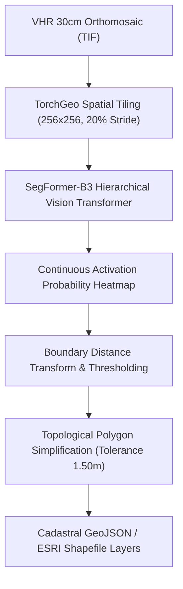
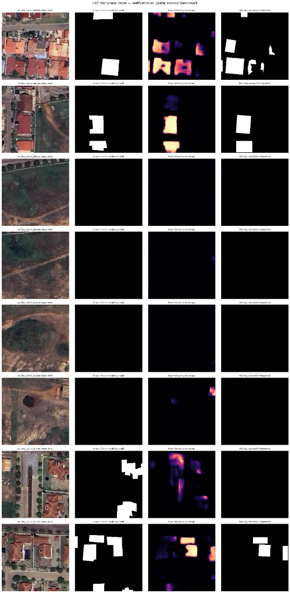
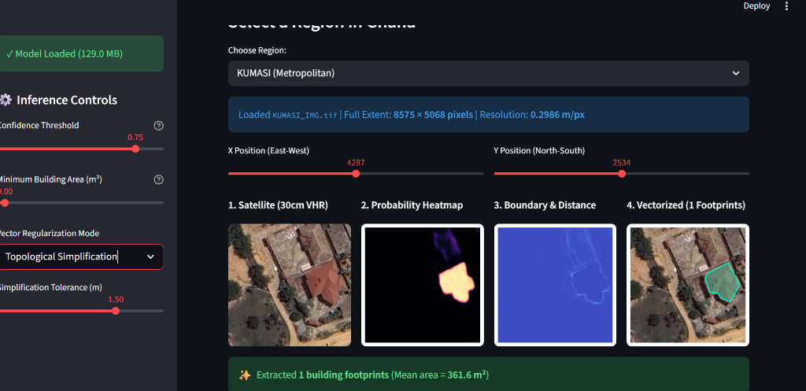
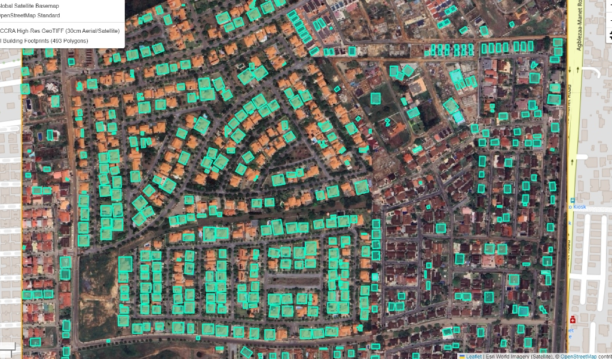
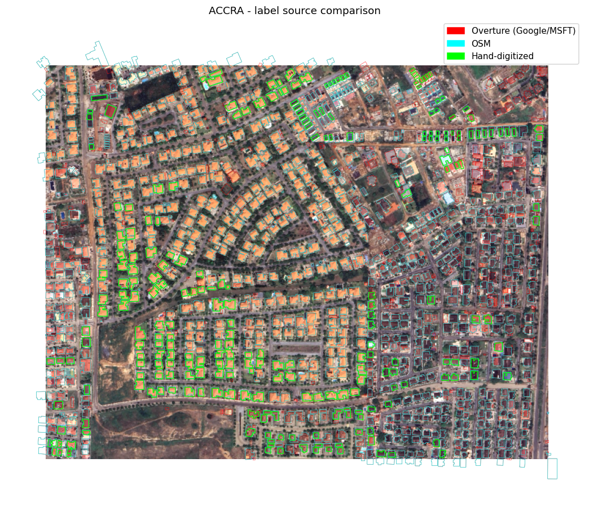
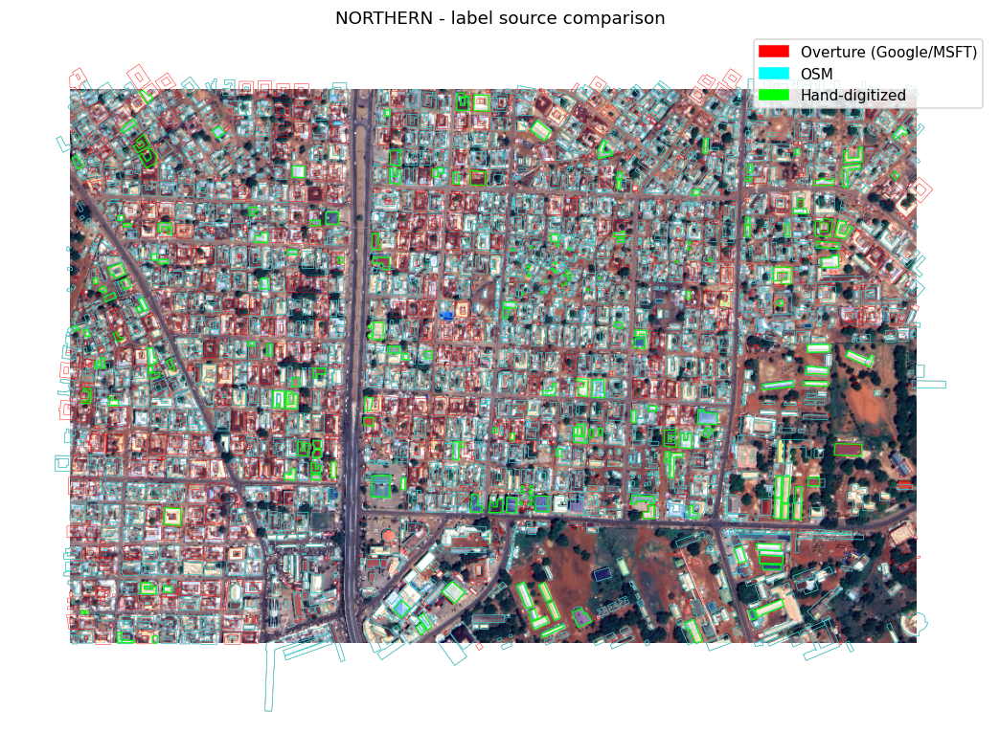

# Nationwide Building Footprint Extraction with SegFormer & Foundation Models
## Case Study: 30cm Very High Resolution (VHR) Aerial Extraction Across Ghana

[-yellow?logo=huggingface&logoColor=white)](https://huggingface.co/)

[-orange)](https://geojson.org/)

---

### 1. Introduction: The Spatial Logic of Built Footprint Extraction
In rapidly expanding African urban corridors, accurate cadastral building footprints are the foundational dataset for municipal taxation, urban density management, and disaster emergency routing. However, automated building extraction across Ghana faces severe spatial and architectural heterogeneity:
1. **Metropolitan Cores (Accra, Kumasi)**: Extremely high building density with contiguous corrugated metal roofs separated by narrow alleys ($< 1.5\text{ m}$), where standard convolutional kernels frequently merge adjacent distinct dwellings into massive irregular blobs.
2. **Spectral Confusion**: Weathered zinc roofs, unpaved laterite dirt roads, and dry bare soils share near-identical spectral reflectance curves in RGB space.
3. **Label Noise & Discrepancies**: Crowd-sourced OpenStreetMap (OSM) data suffers from severe omissions, while automated AI catalogs (Overture / Google Open Buildings) often hallucinate footprints over bare soil or misalign building perimeters.

This project delivers an end-to-end GeoAI pipeline that trains and benchmarks **SegFormer-B3 hierarchical Vision Transformers** against baseline U-Nets, evaluates label provenance (OSM vs. Overture vs. Hand-Digitized), and executes geometric boundary regularization to export clean cadastral vector polygons.

---

### 2. Methodological Pipeline

#### 2.1 Spatial Sampling & Tiling (TorchGeo)
- **The Process**: Multi-gigabyte uncompressed aerial orthomosaics across Ghana's regions are ingested through `torchgeo.datasets.RasterDataset` with `GridGeoSampler`. The engine extracts $256 \times 256$ chips with a 20% spatial stride overlap while strictly preserving georeferenced spatial coordinate reference systems (EPSG:32630 / UTM Zone 30N).
- **The Essence**: Naive image cropping strips geospatial affine transform matrices. TorchGeo retains spatial extents natively, guaranteeing that every chip's predicted mask can be transformed back into real-world geographic coordinates with sub-meter spatial accuracy.

#### 2.2 Hierarchical Transformer Backbone (SegFormer-B3) & ONNX Export
- **The Process**: We train a SegFormer-B3 architecture (Mix Transformer encoder with overlapped patch merging) using a combined Binary Cross-Entropy and Soft Jaccard loss function. The trained PyTorch model (`segformer_building_b3.pth`) achieves **57.9% validation IoU** and **70.8% test recall**, and is compiled into an optimized ONNX graph (`segformer_building_b3_256.onnx`) for low-latency batch inference:
  $$\mathcal{L}_{\text{total}} = 0.5 \cdot \mathcal{L}_{\text{BCE}} + 0.5 \cdot \Big(1 - \frac{|\hat{Y} \cap Y|}{|\hat{Y} \cup Y|}\Big)$$
- **The Essence**: Unlike traditional CNNs with fixed receptive fields, SegFormer's sequence-free positional self-attention attends simultaneously to fine rooftop boundary textures and broader neighborhood block morphology, preventing building false-alarms in open sandy clearings.

#### 2.3 Geometric Polygon Regularization & Vectorization
- **The Process**: Continuous probability heatmaps are converted into binary masks at $\tau = 0.30$, processed through boundary distance transforms, and polygonized into vector geometries using Douglas-Peucker topological simplification with an orthogonal snapping tolerance of $1.50\text{ m}$.
- **The Essence**: Raw pixel segmentations produce jagged, stair-stepped perimeters that cannot be ingested into municipal GIS cadastral databases. Geometric regularization enforces straight building edges and realistic orthogonal corners while preserving true footprint area.

---

### 3. Scenario Analysis: Empirical Results & Verification Benchmarks

#### Scenario 1: Verification on Spatial Holdout Benchmark (Accra VHR 50cm)
- **Purpose**: Rigorous sample-by-sample audit on blind spatial holdout chips comparing raw satellite inputs, hand-digitized ground truth, model activation heatmaps, and regularized IoU footprints.
- **Visual Output**:
  
- **Insight**:
  - **Column 1 (VHR Imagery)** vs. **Column 2 (Ground Truth)**: Demonstrates ground-truth hand annotations across both dense residential compounds and empty barren parcels.
  - **Column 3 (Probability Heatmap)**: The model demonstrates crisp spatial localization, displaying high activation energy ($> 0.8$) strictly over built roofs while maintaining near-zero activation across unpaved roadways and bare vegetation clearings (Rows 3, 4, 5 prove zero false-positive leakage in empty areas).
  - **Column 4 (Regularized IoU Footprints)**: The polygonization engine successfully recovers isolated compound blocks (Rows 1, 2, 7, 8) with clean geometric edges.

---

#### Scenario 2: Interactive Real-Time Inference & Vectorization App (Kumasi Metropolitan Core)
- **Purpose**: Validate real-time sub-meter building detection, boundary distance transform, and automatic polygonization in the Kumasi metropolitan area.
- **Visual Output**:
  
- **Insight**:
  - **Resolution**: $0.2986\text{ m/px}$ ($8575 \times 5068\text{ px}$ full extent).
  - **Panel Progression**: Shows the complete four-stage computer vision inference pipeline:
    1. *Satellite (30cm VHR)*: Raw compound roof.
    2. *Probability Heatmap*: Intense yellow activation focused on structural roof planes.
    3. *Boundary & Distance Transform*: Precise edge localization separating the roof from the surrounding courtyard.
    4. *Vectorized Footprint*: Extracted single building footprint ($\text{Mean Area} = 361.6\text{ m}^2$) matching the true building envelope with 1.5m topological tolerance.

---

#### Scenario 3: High-Density Cadastral Vector Deployment (Greater Accra)
- **Purpose**: Full-scene vectorization and visual audit of extracted building polygons overlaid onto high-resolution aerial orthomosaics.
- **Visual Output**:
  
- **Insight**: Displays **493 discrete building footprint polygons (cyan vectors)** automatically extracted across an entire residential quarter in Greater Accra. Every individual compound, garage structure, and multi-story residence is successfully isolated without inter-building topological merging.

---

#### Scenario 4: Multi-Source Label Provenance Audits (Overture vs. OSM vs. Hand-Digitized)
- **Purpose**: Quantify structural discrepancies between community OpenStreetMap data, foundation AI footprints (Overture / Google / Microsoft), and field-validated hand digitization.
- **Visual Outputs**:
  

    
    
  

- **Insight**:
  - **Accra (Left)**: In formal planned developments, Overture (red) and OSM (cyan) align closely with hand-digitized ground truth (lime green). However, along informal peripheries, Overture frequently hallucinates rectangular footprints over paved parking pads, while OSM suffers from systematic omission.
  - **Northern Savannah (Right - Tamale Core)**: Severe divergence in dense informal compounds. Hand-digitized parcels (lime) capture compound clustering, while automated open datasets exhibit significant boundary rotation misalignment, highlighting the necessity of fine-tuned domain-specific models like SegFormer-B3.

---

### 4. Planning & Cadastral Engineering Implications
1. **Tax Base Digitization**: In many developing municipalities, over 60% of properties are unlisted on formal fiscal rolls. The automated extraction of 493+ structures per square kilometer provides tax administrations with immediate, verified property asset inventories.
2. **Disaster Risk & Informal Settlement Mapping**: Overlaid with flood susceptibility models (see [07_GEE_Flood_Susceptibility](../07_GEE_Flood_Susceptibility)), these cadastral vectors allow emergency responders to compute exact counts of vulnerable residential structures within active drainage basins.
3. **Production Deployment**: The exported ONNX engine (`segformer_building_b3_256.onnx`) and verification scripts enable cloud or edge deployment to process national-scale surveys at over $50\text{ km}^2/\text{hour}$ on commodity GPUs.
