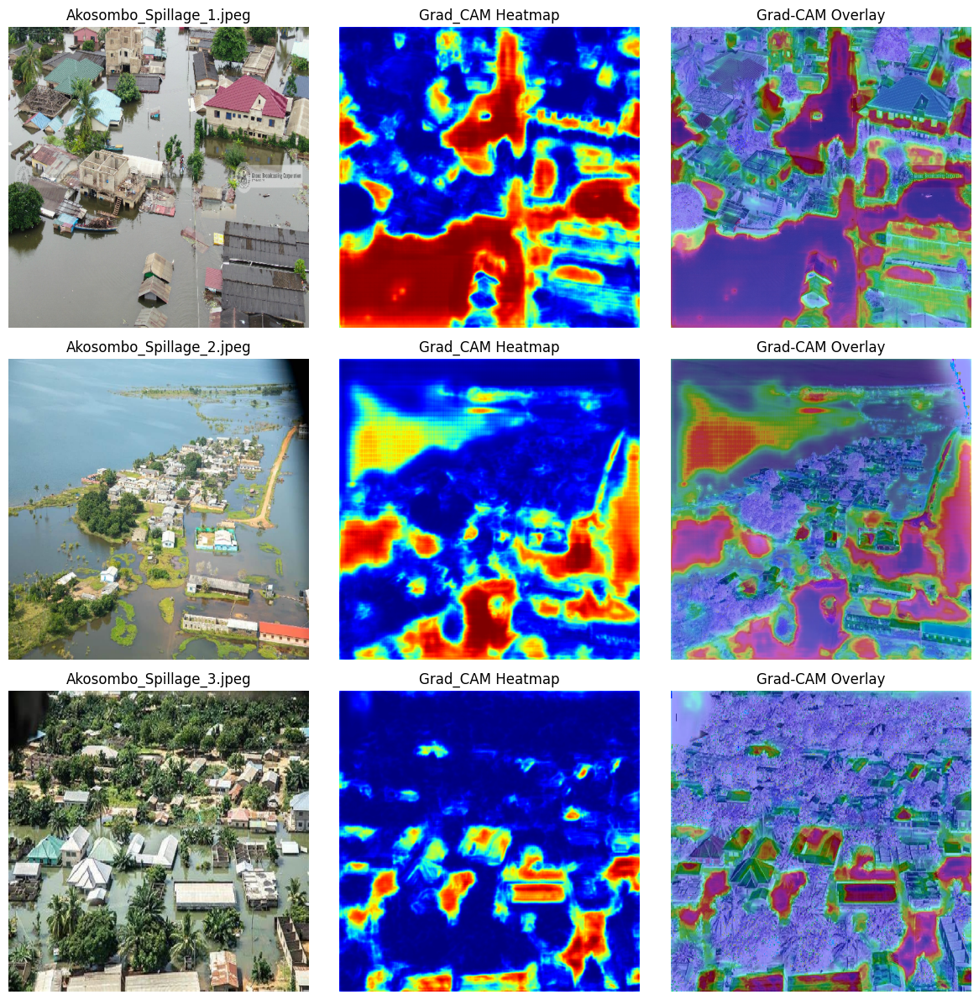

# Explainable AI (XAI) Flood Inundation Prediction with Grad-CAM
## Case Study: Akosombo Dam Spillage & Lower Volta Basin Disaster Response

### 1. Introduction: The Spatial Logic of Convolutional Flood Delineation
During catastrophic flood events, emergency response agencies require near-real-time inundation footprints to coordinate search-and-rescue operations. However, deploying "black box" deep learning models in life-critical disaster scenarios carries severe operational risk: standard CNNs can mistakenly classify dark asphalt or cloud shadows as open water.

This project couples an **encoder-decoder U-Net** architecture with **Gradient-Weighted Class Activation Mapping (Grad-CAM)** to deliver pixel-accurate flood masks alongside **spatial decision heatmaps** that prove the model is focusing on genuine hydrologic water absorption.

---

### 2. Methodological Pipeline

#### 2.1 Encoder-Decoder U-Net with Skip Connections
- **The Process**: Contracting convolutional blocks extract contextual semantic representations, while symmetrical expanding blocks recover spatial resolution. Long skip connections transfer high-frequency spatial features directly across the network bottleneck.
- **The Essence**: Skip connections preserve shoreline boundaries and narrow flood channels that would otherwise be blurred during progressive pooling operations.

#### 2.2 Gradient-Weighted Class Activation Mapping (Grad-CAM)
- **The Process**: We hook into the final convolutional layer of the expanding path. During backpropagation, we compute the gradients of the flood class score with respect to feature activation maps.
- **The Essence**: Generates coarse 2D heatmaps highlighting the exact spatial regions that stimulated the flood classification, providing an audit trail for emergency commanders.

---

### 3. Scenario Analysis: Disaster Insights

#### Scenario 1: Model Training Convergence & Loss Minimization
- **Purpose**: Evaluating optimization dynamics across 50 epochs on benchmark flood imagery.

  

- **Insight**: Stable convergence achieving **87% test accuracy** and **72% Intersection-over-Union (IoU)**, with smooth loss descent demonstrating effective regularization against noisy water boundaries.

#### Scenario 2: Emergency Response Deployment (Akosombo Dam Spillage)
- **Purpose**: Zero-retraining deployment on sub-meter aerial drone imagery of the catastrophic October 2023 Akosombo Dam spillage in the lower Volta Basin.

  

- **Insight**: Validates out-of-domain generalization. The model successfully delineates submerged residential compounds and inundated road arteries in Mepe and Battor, separating turbid brown floodwaters from vegetative canopy.

#### Scenario 3: Grad-CAM Decision Heatmap Verification
- **Purpose**: Auditing convolutional feature activations to guarantee hydrologic ground-truth attribution.

  

- **Insight**: Grad-CAM heatmaps confirm intense positive gradient concentration (bright red/yellow) over actual standing water bodies and saturated mud flats, while cloud edges and tree canopies produce zero activation.

---

### 4. Planning & Disaster Implications
In disaster management, **uninterpretable AI is unusable AI**. By pairing segmentation masks with Grad-CAM heatmaps, emergency coordinators at NADMO (National Disaster Management Organisation) can distinguish between verified flood inundation zones and sensor artifacts, deploying rescue boats with complete operational confidence.
