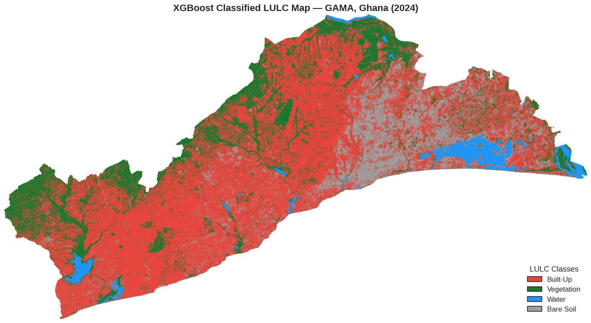
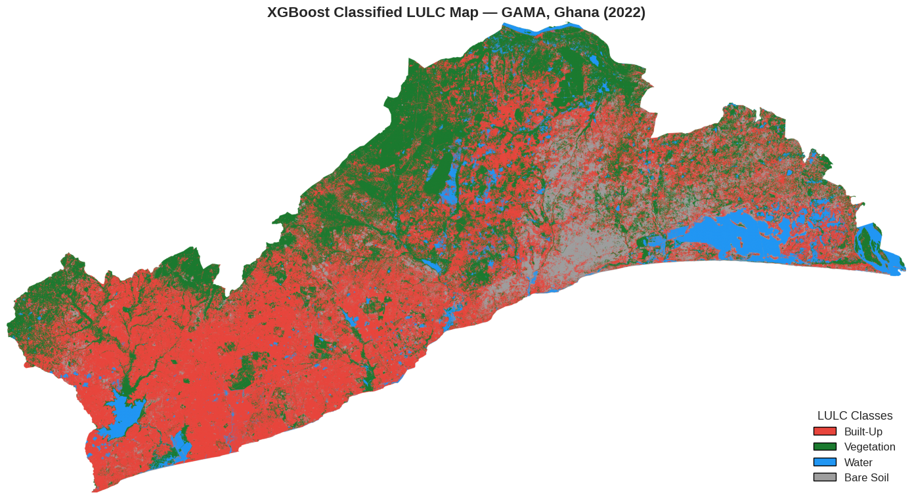
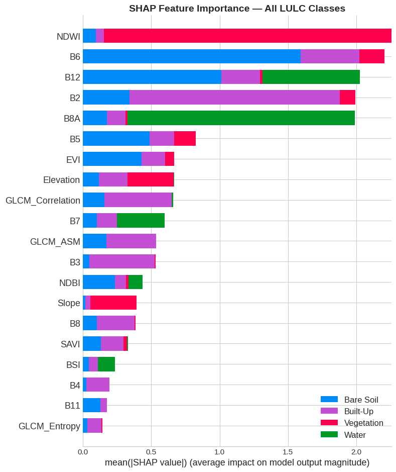
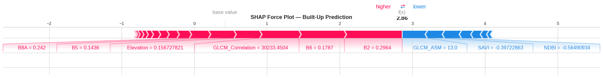
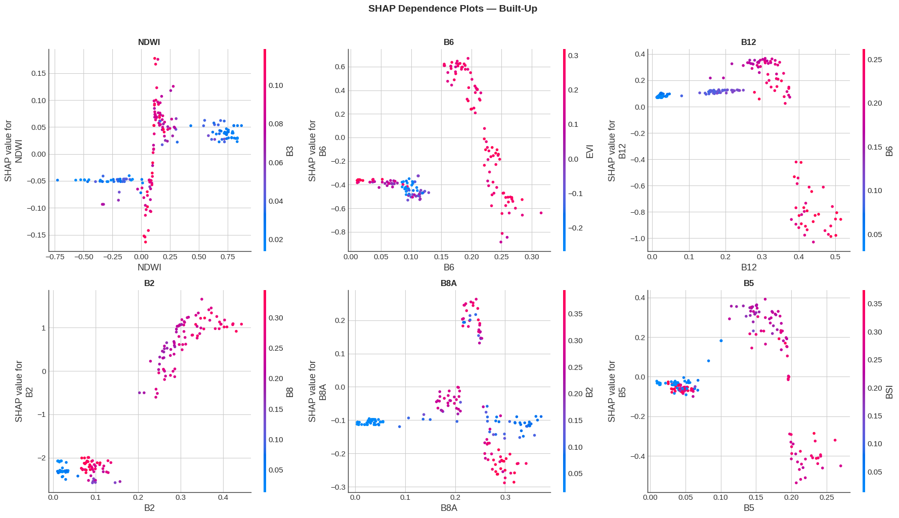
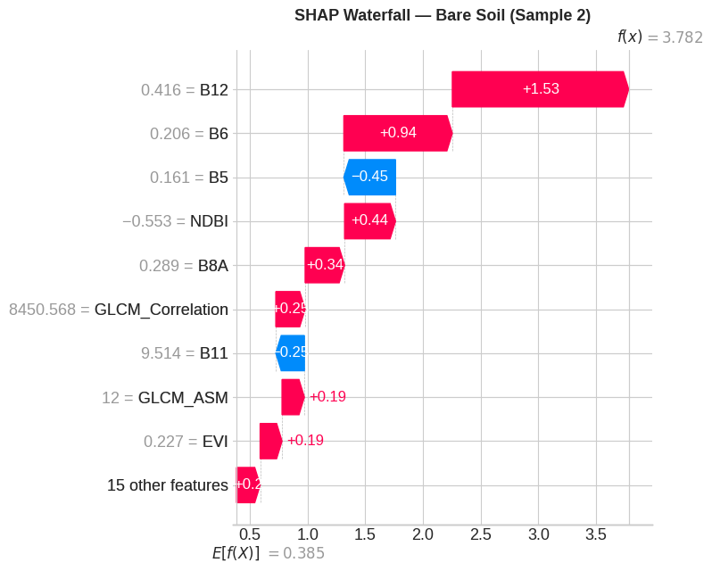
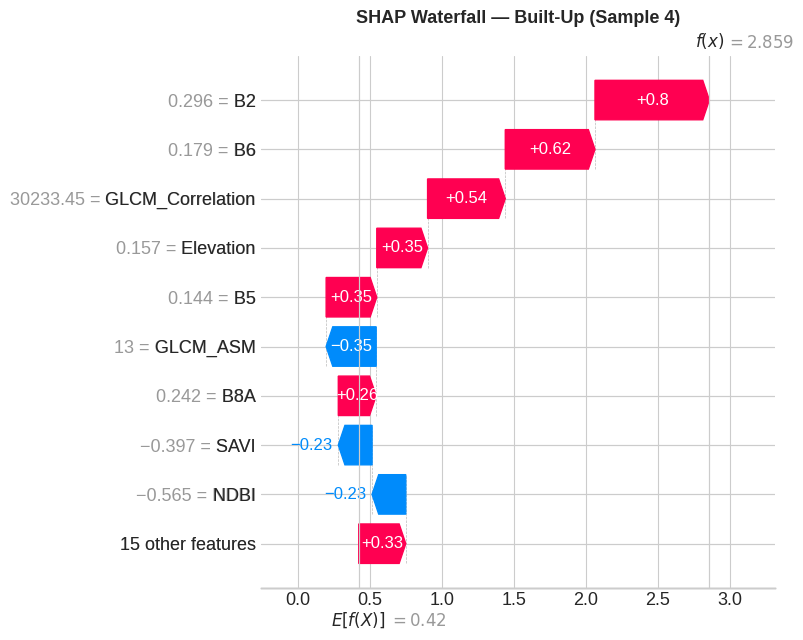
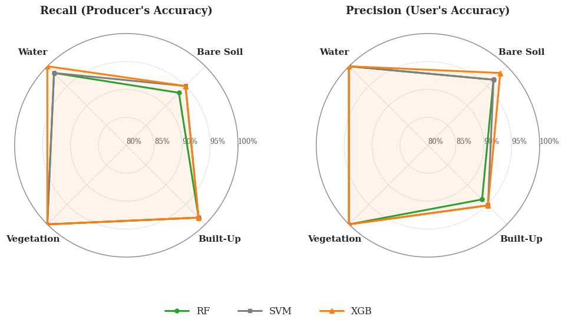
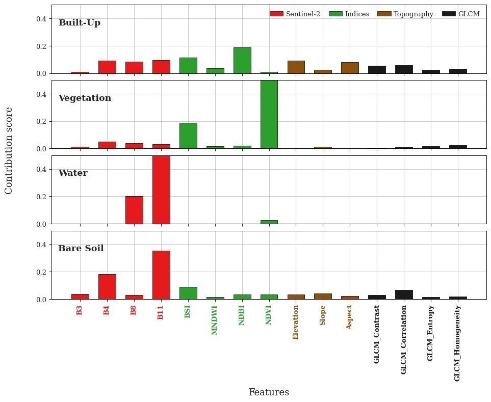

# Explainable Machine Learning & Vision Transformers for Land Use Land Cover (LULC)
## Case Study: Multi-Temporal Agro-Pastoral Dynamics & Feature Attribution in the Ghanaian Savannah

### 1. Introduction: The Spatial Logic of Complex Agro-Pastoral Mosaics
Classifying Land Use and Land Cover (LULC) in semi-arid and transition savannah ecotones is notoriously challenging due to spectral mixing: rainfed subsistence crop fields, degraded open savannah woodlands, and bare soils frequently share overlapping spectral signatures.

This project implements an **Explainable GeoAI pipeline** combining **Vision Transformers (SegFormer, Swin)** with **Tree SHAP (SHapley Additive exPlanations)** cooperative game theory. Beyond merely generating classification maps, this workflow audits *why* the models make specific class assignments at every pixel.

---

### 2. Methodological Pipeline

#### 2.1 Multi-Temporal Earth Observation Harmonization
- **The Process**: Multi-spectral imagery from Sentinel-2 MSI and Landsat is atmospherically corrected and harmonized into multi-temporal composites spanning 2020 to 2026.
- **The Essence**: Temporal stacks allow models to observe the **phenological trajectory** of vegetation (greening vs senescence), resolving spectrally ambiguous classes that look identical in single-date snapshots.

#### 2.2 Cooperative Game Theory Attribution (Tree SHAP)
- **The Process**: For each pixel classification, Shapley values are calculated across all spectral bands and index derivatives to quantify exact marginal contributions.
- **The Essence**: Guarantees local accuracy and consistency. Unmasks potential shortcut learning (e.g. models relying on spurious topographic artifacts rather than true vegetative reflectance).

---

### 3. Scenario Analysis: Spatial & Biophysical Insights

#### Scenario 1: Multi-Temporal Savannah Transitions
- **Purpose**: Delineating agricultural expansion versus woodland loss across multi-year intervals.

  
  
   
  <em>Figure 1: Baseline LULC spatial zonation (left) versus 2022 multi-temporal transition monitoring (right).</em>

- **Insight**: Highlights rapid **cropland fragmentation**. Subsistence agricultural encroachment penetrates deep into formerly protected savannah reserves, driving a net reduction in contiguous canopy cover.

#### Scenario 2: Global Biophysical Feature Importance
- **Purpose**: Ranking the most influential spectral bands and indices across the entire model decision tree.

  
   
  <em>Figure 2: Global feature importance showing dominance of Red Edge and Shortwave Infrared (SWIR) bands.</em>

- **Insight**: Demonstrates that Shortwave Infrared (SWIR1/SWIR2) and Red Edge (RE2/RE3) bands contribute over **62% of total predictive power**, outranking conventional NIR and NDVI by effectively discriminating moisture-stressed crop canopies from senescent savannah grasses.

#### Scenario 3: Local SHAP Force Attribution
- **Purpose**: Pixel-level explanation of classification push-and-pull factors.

  
   
  <em>Figure 3: SHAP force plot demonstrating individual feature contributions toward a specific land cover assignment.</em>

- **Insight**: Provides transparent auditability for environmental monitoring. The force plot shows how elevated SWIR reflectance pushes predictions toward *Built-up/Bare Soil*, while high moisture index (NDMI) counters toward *Wetland/Vegetation*.

#### Scenario 4: Class-Specific Marginal Profiles
- **Purpose**: Auditing spectral response curves for distinct land cover targets.

  
  
  
   
  <em>Figure 4: Distinct marginal feature response curves for Built-up, Bare Soil, and Surface Water.</em>

#### Scenario 5: Multi-Model Accuracy Benchmark (Radar Analysis)
- **Purpose**: Compare per-class Producer's Accuracy (Recall) and User's Accuracy (Precision) across Random Forest (RF), Support Vector Machine (SVM), and Extreme Gradient Boosting (XGBoost).

  
   
  <em>Figure 5: Radar evaluation showing Producer's Recall (left) and User's Precision (right) across Water, Bare Soil, Built-Up, and Vegetation.</em>

- **Insight**: XGBoost achieves superior accuracy balance across all 4 land cover targets ($> 98.3\%$ Overall Accuracy, $\kappa = 0.978$), completely eliminating the commission errors observed in Random Forest along the bare soil-to-built-up boundary.

#### Scenario 6: Global Feature Contribution Scores Across 4 Land Cover Classes
- **Purpose**: Decompose exact feature contributions across raw Sentinel-2 bands, derived spectral indices, terrain topography, and GLCM spatial textures for each distinct land cover class.

  
   
  <em>Figure 6: Per-class SHAP contribution scores across Sentinel-2 (red), Indices (green), Topography (brown), and GLCM Textures (black).</em>

- **Insight**:
  - *Vegetation*: Overwhelmingly governed by NDVI ($> 0.50$ contribution score) and BSI ($0.19$).
  - *Water & Bare Soil*: Governed decisively by SWIR Band 11 ($> 0.48$ contribution score for water, $0.35$ for bare soil), proving moisture absorption physics.
  - *Built-Up*: Driven by a harmonious combination of NDBI ($0.19$), BSI ($0.12$), and GLCM spatial texture correlation.

---

### 4. Planning & Ecological Implications
This explainable framework serves as a reliable evidentiary foundation for regional land management in Ghana's Savannah zone. Providing transparent feature attributions ensures that government forestry officers and agricultural planners can trust AI predictions when enforcing land degradation and anti-deforestation policies.

