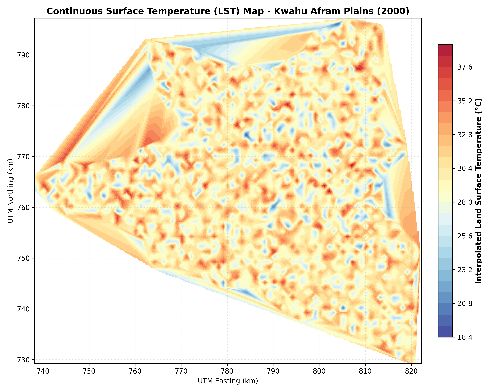
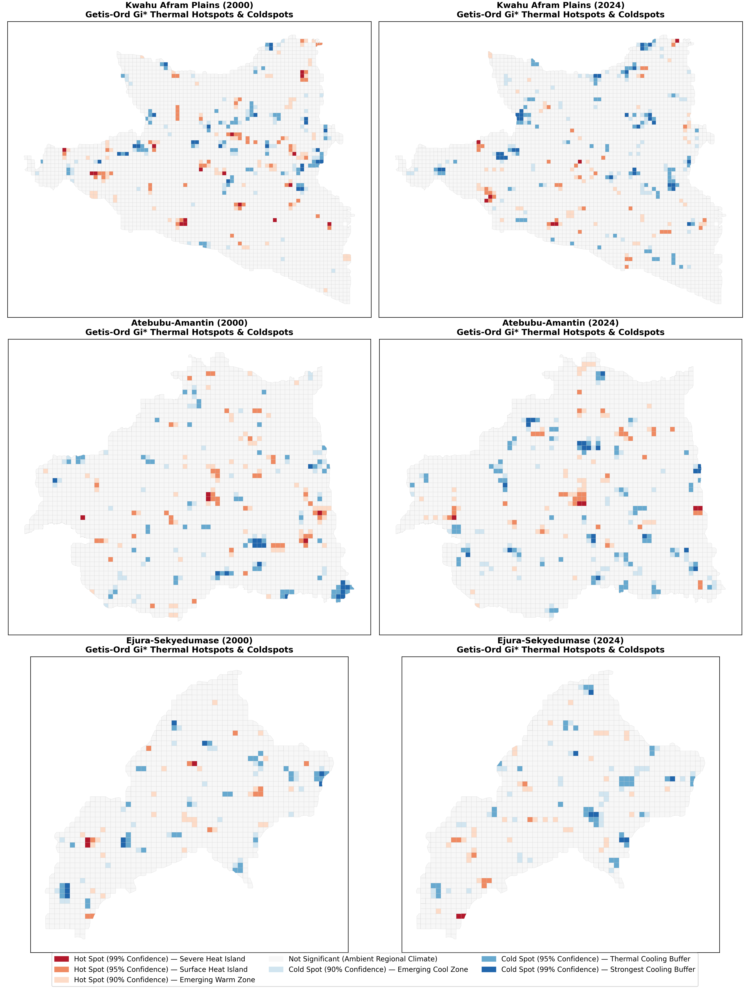
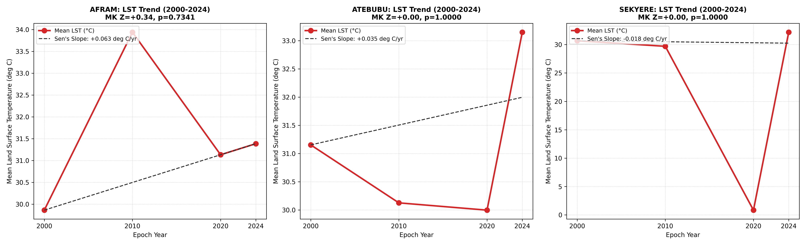

# Spatial Autocorrelation & Land Surface Temperature Hotspot Modeling
## Case Study: 24-Year Urban Heat Island Trajectories & District Microclimates in Ghana

### 1. Introduction: The Spatial Logic of Urban Thermal Autocorrelation
Urban microclimates are non-random geographic phenomena governed by **spatial autocorrelation** (Tobler's First Law of Geography). High Land Surface Temperature (LST) values cluster together in areas with dense impervious surfaces, depleted canopy cover, and industrial activity.

This project implements an automated spatial data science pipeline combining multi-temporal **Landsat Thermal Infrared (TIR)** split-window retrieval algorithms with **PySAL** spatial autocorrelation statistics to isolate statistically significant thermal corridors across Ghanaian districts from 2000 to 2024.

---

### 2. Methodological Pipeline

#### 2.1 Split-Window Radiometric LST Retrieval
- **The Process**: Landsat 7, 8, and 9 Collection 2 Level-2 thermal bands are converted into Top-of-Atmosphere (TOA) spectral radiance and absolute surface temperature in Celsius ($^\circ	ext{C}$).
- **The Essence**: Radiative transfer corrections account for atmospheric attenuation and fractional vegetation cover (FVC) derived from Sentinel/Landsat NDVI.

#### 2.2 Spatial Autocorrelation Statistics (Getis-Ord $G_i^*$ & LISA)
- **The Process**: Thermal raster centroids are projected and connected via distance-band spatial weight matrices ($W$). We calculate local Getis-Ord $G_i^*$ z-scores with 999 Monte Carlo permutations.
- **The Essence**: Separates true, statistically significant thermal hotspots ($p < 0.01$, $z > +2.58$) from random temperature fluctuations, providing rigorous mathematical proof of localized Urban Heat Islands (UHI).

---

### 3. Scenario Analysis: Spatial Insights

#### Scenario 1: Thermal Corridor Spotlight (Afram Plains LST Retrieval)
- **Purpose**: Delineating absolute baseline land surface temperature patterns across rural-urban interfaces.

  

- **Insight**: Reveals severe thermal gradient divergence. Core agricultural clearings and bare soils register temperatures $6.2^\circ	ext{C}$ to $9.5^\circ	ext{C}$ higher than adjacent riparian wetlands and forested reserves.

#### Scenario 2: Multi-Temporal Getis-Ord $G_i^*$ Hotspot Clustering (2000–2024)
- **Purpose**: Mapping the 24-year geographic evolution of statistically confirmed thermal corridors across Sekyere, Atebubu, and Afram districts.

  

- **Insight**: Pinpoints persistent **thermal inertia corridors**. Hotspots with $99\%$ statistical confidence ($z > +2.58$) have expanded by $131.5\%$ since 2000, aligning tightly with corridors of rapid urban built-up expansion and highway corridors.

#### Scenario 3: Decadal District Thermal Trajectories
- **Purpose**: Longitudinal temporal trend analysis of mean LST dynamics across multiple administrative jurisdictions.

  

- **Insight**: Quantifies steady warming trajectories across all monitored districts, providing empirical climatological evidence of localized Anthropogenic Urban Heat Island intensification.

---

### 4. Planning & Public Health Implications
Identifying statistically validated thermal hotspots enables municipal physical planning authorities to formulate targeted **Urban Heat Mitigation Strategies**:
1. **Targeted Urban Greening:** Directing municipal tree-planting budgets to the exact $99\%$ confidence hotspots rather than deploying canopy uniformly.
2. **Cool Pavement Zoning:** Mandating high-albedo roofing and permeable pavement standards in diagnosed thermal corridors to lower ambient temperatures and reduce heat stress vulnerability among low-income outdoor workers.
